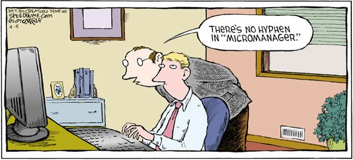

# microman - Micromanager




## What is micromanaging? 

Micromanaging is a management style where you have excessive control over every detail and aspect of the project without regard to the impact on others or yourself.

1. Have a hard time asking for help
1. Check in frequently to see if the work is being done/done your way
1. Monitor every detail, even the smallest ones
1. Believe that no one can produce what you can
1. Don’t take advice or suggestions from others
1. Make all the decisions involved in the project
1. Believe others are likely to waste time or resources

[- source](https://www.outsourceeasier.com/micromanager/)

## What is microman?

A python library to help you automate common workflows. 

It:

1. Tracks task execution
2. Schedules work
3. Keeps track of artifacts
4. Comes with common tasks built in
5. Runs your tasks on distributed clusters
6. Automates you out of your job

# Getting started

```commandline
pip install microman
```


```python
from microman import task


@task
def train_model():
  pass
```
